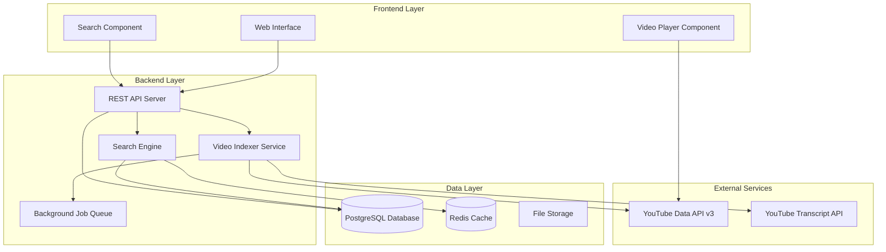

# Design Document

## Overview

The YouTube Content Search system is a web application that indexes YouTube channel content through subtitle extraction and provides intelligent search capabilities with timestamp-based video playback. The system consists of a backend API for data processing and search, a frontend web interface for user interactions, and a database for content storage.

## Architecture

The system follows a three-tier architecture:



## Components and Interfaces

### Frontend Components

#### Web Interface
- **Technology**: React with TypeScript
- **Responsibilities**: 
  - Channel management interface
  - Search query input and results display
  - Video player integration with timestamp navigation
  - Progress tracking for indexing operations

#### Search Component
- **Interface**: 
  ```typescript
  interface SearchProps {
    onSearch: (query: string) => Promise<SearchResult[]>
    onTimestampClick: (videoId: string, timestamp: number) => void
  }
  ```

#### Video Player Component
- **Technology**: YouTube Embedded Player API
- **Interface**:
  ```typescript
  interface PlayerProps {
    videoId: string
    startTime?: number
    onReady: () => void
  }
  ```

### Backend Components

#### REST API Server
- **Technology**: Node.js with Express and TypeScript
- **Endpoints**:
  - `POST /api/channels` - Add new channel for indexing
  - `GET /api/channels` - List all indexed channels
  - `DELETE /api/channels/:id` - Remove channel and its data
  - `POST /api/search` - Search across indexed content
  - `GET /api/indexing/status/:channelId` - Get indexing progress
  - `POST /api/indexing/start/:channelId` - Start/restart indexing

#### Video Indexer Service
- **Responsibilities**:
  - Fetch channel videos using YouTube Data API v3
  - Extract subtitles using YouTube Transcript API
  - Process and store subtitle data with timestamps
  - Handle rate limiting and error recovery
- **Interface**:
  ```typescript
  interface IndexerService {
    indexChannel(channelId: string): Promise<IndexingResult>
    getIndexingStatus(channelId: string): Promise<IndexingStatus>
    updateChannel(channelId: string): Promise<UpdateResult>
  }
  ```

#### Search Engine
- **Technology**: Elasticsearch or PostgreSQL with full-text search
- **Responsibilities**:
  - Semantic search across subtitle content
  - Ranking and relevance scoring
  - Query processing and result formatting
- **Interface**:
  ```typescript
  interface SearchEngine {
    search(query: string, filters?: SearchFilters): Promise<SearchResult[]>
    indexContent(content: SubtitleContent): Promise<void>
    deleteChannelContent(channelId: string): Promise<void>
  }
  ```

#### Background Job Queue
- **Technology**: Bull Queue with Redis
- **Responsibilities**:
  - Process video indexing jobs asynchronously
  - Handle retry logic for failed operations
  - Manage concurrent processing limits

## Data Models

### Channel Model
```typescript
interface Channel {
  id: string
  channelId: string // YouTube channel ID
  name: string
  description?: string
  thumbnailUrl?: string
  videoCount: number
  indexedVideoCount: number
  lastIndexed: Date
  indexingStatus: 'pending' | 'in_progress' | 'completed' | 'failed'
  createdAt: Date
  updatedAt: Date
}
```

### Video Model
```typescript
interface Video {
  id: string
  videoId: string // YouTube video ID
  channelId: string
  title: string
  description?: string
  duration: number // in seconds
  publishedAt: Date
  thumbnailUrl?: string
  hasSubtitles: boolean
  subtitleLanguage?: string
  indexingStatus: 'pending' | 'completed' | 'failed' | 'no_subtitles'
  createdAt: Date
  updatedAt: Date
}
```

### Subtitle Model
```typescript
interface Subtitle {
  id: string
  videoId: string
  startTime: number // in seconds
  endTime: number // in seconds
  text: string
  confidence?: number // for auto-generated subtitles
  createdAt: Date
}
```

### Search Result Model
```typescript
interface SearchResult {
  videoId: string
  videoTitle: string
  channelName: string
  relevanceScore: number
  matchedSegments: Array<{
    startTime: number
    endTime: number
    text: string
    highlightedText: string
  }>
  summary: string
}
```

## Error Handling

### API Rate Limiting
- Implement exponential backoff for YouTube API calls
- Queue requests to stay within API quotas
- Cache channel and video metadata to reduce API calls

### Subtitle Extraction Failures
- Retry failed extractions up to 3 times with increasing delays
- Log videos without available subtitles
- Continue processing other videos when individual failures occur

### Database Connection Issues
- Implement connection pooling with automatic reconnection
- Use database transactions for data consistency
- Implement circuit breaker pattern for external service calls

### Search Performance
- Implement query timeout limits (3 seconds)
- Use caching for frequently searched terms
- Implement pagination for large result sets

## Testing Strategy

### Unit Testing
- Test individual components and services in isolation
- Mock external API calls (YouTube Data API, Transcript API)
- Test data models and validation logic
- Target 80%+ code coverage

### Integration Testing
- Test API endpoints with real database connections
- Test YouTube API integration with test channels
- Test search functionality with sample data
- Test background job processing

### End-to-End Testing
- Test complete user workflows from channel addition to search
- Test video player integration with timestamp navigation
- Test error scenarios and recovery mechanisms
- Performance testing with large datasets

### Performance Testing
- Load testing for concurrent search queries
- Stress testing for large-scale video indexing
- Database performance testing with realistic data volumes
- API response time monitoring

## Security Considerations

### API Security
- Implement rate limiting on all endpoints
- Use API keys for YouTube API access
- Validate and sanitize all user inputs
- Implement CORS policies for frontend access

### Data Protection
- Store YouTube API keys securely using environment variables
- Implement database connection encryption
- Regular security updates for all dependencies
- Input validation to prevent injection attacks

## Scalability Considerations

### Database Optimization
- Index frequently queried fields (video_id, channel_id, timestamps)
- Partition subtitle data by channel or date ranges
- Implement database connection pooling
- Consider read replicas for search-heavy workloads

### Caching Strategy
- Cache search results for popular queries
- Cache channel metadata and video information
- Implement cache invalidation strategies
- Use CDN for static assets

### Background Processing
- Horizontal scaling of worker processes
- Queue prioritization for user-requested indexing
- Monitoring and alerting for job failures
- Resource usage optimization for large channels